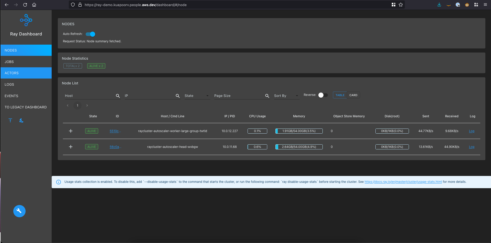
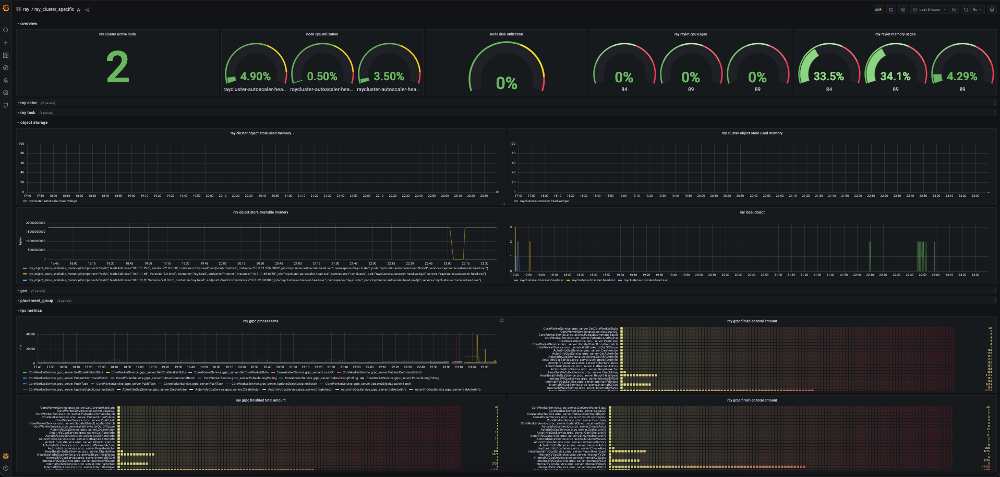

# Ray with Amazon EKS

> 🛑 This blueprint should be considered as experimental and should only be used for proof of concept.


This example deploys an EKS Cluster running the Ray Operator.

- Creates a new sample VPC, 3 Private Subnets and 3 Public Subnets
- Creates Internet gateway for Public Subnets and NAT Gateway for Private Subnets
- Creates EKS Cluster Control plane with public endpoint (for demo reasons only) with one managed node group
- Deploys Ray Operator, AWS Load Balancer Controller, Ingress-nginx and External DNS (optional) add-ons
- Deploys a Ray Cluster in the `ray-cluster` namespace

## Prerequisites

Ensure that you have installed the following tools on your machine.

1. [aws cli](https://docs.aws.amazon.com/cli/latest/userguide/install-cliv2.html)
2. [kubectl](https://Kubernetes.io/docs/tasks/tools/)
3. [terraform](https://learn.hashicorp.com/tutorials/terraform/install-cli)
4. [python3](https://www.python.org/)
5. [jq](https://stedolan.github.io/jq/)

Additionally for end-to-end configuration of Ingress, you can optionally provide the following:

1. A [Route53 Public Hosted Zone](https://docs.aws.amazon.com/Route53/latest/DeveloperGuide/dns-configuring.html) configured in the account where you are deploying this example. E.g. "bar.com"
2. An [ACM Certificate](https://docs.aws.amazon.com/acm/latest/userguide/gs-acm-request-public.html) in the account + region where you are deploying this example. A wildcard certificate is preferred, e.g. "*.bar.com"

## Deploy the EKS Cluster with Ray Operator

### Clone the repository

```sh
git clone https://github.com/aws-ia/terraform-aws-eks-blueprints.git
```

### Build Docker Image for Ray Cluster

First, in order to run the RayCluster, we need to push a container image to ECR repository that contains the all the dependencies. You can see the [Dockerfile](sample-job/Dockerfile) to see the python dependencies packaged in. The next series of steps we will setup an ECR repository, build the docker image for our model and push it to the ECR repository.

Create an ECR repository

```sh
aws ecr create-repository --repository-name ray-demo
```

Login to the ECR repository

```sh
aws ecr get-login-password \
  --region $AWS_REGION | docker login \
  --username AWS \
  --password-stdin $ACCOUNT_ID.dkr.ecr.$AWS_REGION.amazonaws.com/ray-demo
```

Build the docker image containing our model deployment.

```sh
docker build sources -t $ACCOUNT_ID.dkr.ecr.$AWS_REGION.amazonaws.com/ray-demo
```

Push the docker image to the ECR repo

```sh
docker push $ACCOUNT_ID.dkr.ecr.$AWS_REGION.amazonaws.com/ray-demo
```

### Initialize Terraform

Navigate into the example directory and run `terraform init`

```sh
cd examples/ai-ml/ray/
terraform init
```

### Terraform Plan

Run Terraform plan to verify the resources created by this execution.

```sh
export AWS_REGION=<enter-your-region>
export ACCOUNT_ID=$(aws sts get-caller-identity | jq -r '.Account')
```

**Optional** - provide a Route53 Hosted Zone hostname and a corresponding ACM Certificate;

```sh
export TF_VAR_eks_cluster_domain="bar.com"
export TF_VAR_acm_certificate_domain="*.bar.com"
```

### Deploy the pattern

```sh
terraform apply
...
...

Outputs:

configure_kubectl = "aws eks --region us-east-1 update-kubeconfig --name ray"
s3_bucket = "ray-demo-models-20220719224423900800000001"
```

Enter `yes` to apply.

Export the s3_bucket to your local environment.

```sh
export S3_BUCKET="s3://ray-demo-models-20220719224423900800000001"
```

### Verify Deployment

Update kubeconfig

```sh
aws eks update-kubeconfig --name ray
```

Verify all pods are running.

```sh
NAMESPACE               NAME                                                        READY   STATUS    RESTARTS        AGE
external-dns            external-dns-99dd9564f-8fsvd                                1/1     Running   2 (6h21m ago)   16d
ingress-nginx           ingress-nginx-controller-659678ccb9-dlc5r                   1/1     Running   2 (6h20m ago)   16d
kube-prometheus-stack   alertmanager-kube-prometheus-stack-alertmanager-0           2/2     Running   4 (6h21m ago)   16d
kube-prometheus-stack   kube-prometheus-stack-grafana-68d4b6d7f4-h97j4              3/3     Running   6 (6h21m ago)   15d
kube-prometheus-stack   kube-prometheus-stack-kube-state-metrics-6d6b967d6d-fc62f   1/1     Running   2 (6h21m ago)   16d
kube-prometheus-stack   kube-prometheus-stack-operator-7c8bffbd9b-5rv59             1/1     Running   2 (6h21m ago)   14d
kube-prometheus-stack   kube-prometheus-stack-prometheus-node-exporter-4hj6g        1/1     Running   2 (6h20m ago)   16d
kube-prometheus-stack   kube-prometheus-stack-prometheus-node-exporter-9pgqc        1/1     Running   2 (6h21m ago)   16d
kube-prometheus-stack   kube-prometheus-stack-prometheus-node-exporter-v46pf        1/1     Running   2 (6h21m ago)   16d
kube-prometheus-stack   prometheus-kube-prometheus-stack-prometheus-0               2/2     Running   4 (6h21m ago)   14d
kube-system             aws-load-balancer-controller-67b5dd7d69-jjq4r               1/1     Running   2 (6h21m ago)   16d
kube-system             aws-load-balancer-controller-67b5dd7d69-pthpn               1/1     Running   2 (6h20m ago)   16d
kube-system             aws-node-7bcvh                                              1/1     Running   3 (6h19m ago)   16d
kube-system             aws-node-csshj                                              1/1     Running   3 (6h19m ago)   16d
kube-system             aws-node-htcmn                                              1/1     Running   4 (6h19m ago)   16d
kube-system             coredns-7f5998f4c-m4lxr                                     1/1     Running   2 (6h21m ago)   16d
kube-system             coredns-7f5998f4c-t78m9                                     1/1     Running   2 (6h20m ago)   16d
kube-system             kube-proxy-4v4pr                                            1/1     Running   2 (6h21m ago)   16d
kube-system             kube-proxy-7rkb7                                            1/1     Running   2 (6h20m ago)   16d
kube-system             kube-proxy-v76mj                                            1/1     Running   2 (6h21m ago)   16d
kuberay-operator        kuberay-operator-7b88c9c4fb-kdhlz                           1/1     Running   2 (6h21m ago)   16d
ray-cluster             raycluster-autoscaler-head-wxbgw                            1/1     Running   0               10m
ray-cluster             raycluster-autoscaler-worker-large-group-twtld              1/1     Running   0               10m
```

#### Ray Dashboard

The Ray Dashboard can be opened at the following url "https://ray-demo.bar.com/dashboard"



### Examples

#### Hugging Face

##### Ray Serve

As a sample, we will use [Ray Serve](https://docs.ray.io/en/latest/serve/index.html) to deploy a sample machine learning model and expose it to the outside world via the Ingress configuration. The code for this deployment can be found [here](sources/hface_t5_summarize_serve.py). We use the [Hugging Face T5](https://huggingface.co/docs/transformers/model_doc/t5) model to serve an endpoint to summarize an arbitrary block of text. This model is deployed as Kubernetes [Job](sample-jobs/summarize-serve-job.yaml).

Create a Job to deploy the model to the Ray Cluster

```sh
envsubst < sample-jobs/summarize-serve-job.yaml | kubectl create -f -

job.batch/ray-summarize-job-cjdd8 created
```

Tail the logs of the job to verify successful deployment of the job.

```sh
kubectl logs -n ray-cluster ray-summarize-job-cjdd8-wmxm8 -f

Caught schedule exception
2022-07-08 17:03:29,579 INFO common.py:220 -- Exception from actor creation is ignored in destructor. To receive this exception in application code, call a method on the actor reference before its destructor is run.
(ServeController pid=458) INFO 2022-07-08 17:03:30,684 controller 458 checkpoint_path.py:17 - Using RayInternalKVStore for controller checkpoint and recovery.
(ServeController pid=458) INFO 2022-07-08 17:03:30,788 controller 458 http_state.py:115 - Starting HTTP proxy with name 'SERVE_CONTROLLER_ACTOR:SERVE_PROXY_ACTOR-node:10.0.12.204-0' on node 'node:10.0.12.204-0' listening on '0.0.0.0:8000'
(HTTPProxyActor pid=496) INFO:     Started server process [496]
(ServeController pid=458) INFO 2022-07-08 17:03:33,701 controller 458 deployment_state.py:1217 - Adding 1 replicas to deployment 'Summarizer'.
Downloading: 100%|██████████| 1.17k/1.17k [00:00<00:00, 2.04MB/s]
Downloading:   0%|          | 0.00/231M [00:00<?, ?B/s]
Downloading:   2%|▏         | 5.68M/231M [00:00<00:03, 59.5MB/s]
Downloading:   5%|▍         | 11.4M/231M [00:00<00:04, 47.3MB/s]
Downloading:   7%|▋         | 16.0M/231M [00:00<00:04, 45.2MB/s]
Downloading:   9%|▉         | 20.5M/231M [00:00<00:04, 45.9MB/s]
Downloading:  11%|█         | 25.8M/231M [00:00<00:04, 48.9MB/s]
Downloading:  13%|█▎        | 31.1M/231M [00:00<00:04, 51.2MB/s]
Downloading:  16%|█▌        | 36.4M/231M [00:00<00:03, 52.7MB/s]
Downloading:  18%|█▊        | 41.5M/231M [00:00<00:03, 52.7MB/s]
Downloading:  20%|██        | 46.6M/231M [00:00<00:03, 52.1MB/s]
Downloading:  22%|██▏       | 51.5M/231M [00:01<00:03, 51.5MB/s]
Downloading:  25%|██▍       | 56.6M/231M [00:01<00:03, 51.9MB/s]
Downloading:  27%|██▋       | 61.7M/231M [00:01<00:03, 52.3MB/s]
Downloading:  29%|██▉       | 66.9M/231M [00:01<00:03, 53.2MB/s]
Downloading:  31%|███       | 72.0M/231M [00:01<00:03, 51.1MB/s]
Downloading:  33%|███▎      | 76.9M/231M [00:01<00:03, 51.2MB/s]
Downloading:  36%|███▌      | 82.2M/231M [00:01<00:02, 52.5MB/s]
Downloading:  38%|███▊      | 87.3M/231M [00:01<00:02, 52.6MB/s]
Downloading:  40%|████      | 92.6M/231M [00:01<00:02, 53.5MB/s]
Downloading:  42%|████▏     | 97.7M/231M [00:01<00:02, 53.5MB/s]
Downloading:  45%|████▍     | 103M/231M [00:02<00:02, 54.2MB/s]
Downloading:  47%|████▋     | 108M/231M [00:02<00:02, 53.5MB/s]
Downloading:  49%|████▉     | 114M/231M [00:02<00:02, 54.3MB/s]
Downloading:  51%|█████▏    | 119M/231M [00:02<00:02, 54.6MB/s]
Downloading:  54%|█████▎    | 124M/231M [00:02<00:02, 54.8MB/s]
Downloading:  56%|█████▌    | 129M/231M [00:02<00:01, 54.2MB/s]
Downloading:  58%|█████▊    | 135M/231M [00:02<00:01, 54.7MB/s]
Downloading:  61%|██████    | 140M/231M [00:02<00:01, 54.2MB/s]
Downloading:  63%|██████▎   | 145M/231M [00:02<00:01, 53.2MB/s]
Downloading:  65%|██████▌   | 150M/231M [00:02<00:01, 53.9MB/s]
Downloading:  67%|██████▋   | 155M/231M [00:03<00:01, 44.7MB/s]
Downloading:  70%|██████▉   | 161M/231M [00:03<00:01, 48.3MB/s]
Downloading:  72%|███████▏  | 167M/231M [00:03<00:01, 51.2MB/s]
Downloading:  74%|███████▍  | 172M/231M [00:03<00:01, 52.3MB/s]
Downloading:  77%|███████▋  | 177M/231M [00:03<00:01, 50.8MB/s]
Downloading:  79%|███████▉  | 182M/231M [00:03<00:00, 52.2MB/s]
Downloading:  81%|████████▏ | 188M/231M [00:03<00:00, 53.2MB/s]
Downloading:  84%|████████▎ | 193M/231M [00:03<00:00, 54.2MB/s]
Downloading:  86%|████████▌ | 198M/231M [00:03<00:00, 53.9MB/s]
Downloading:  88%|████████▊ | 204M/231M [00:04<00:00, 53.6MB/s]
Downloading:  90%|█████████ | 209M/231M [00:04<00:00, 53.5MB/s]
Downloading:  93%|█████████▎| 214M/231M [00:04<00:00, 54.0MB/s]
Downloading:  95%|█████████▍| 219M/231M [00:04<00:00, 54.6MB/s]
Downloading:  97%|█████████▋| 225M/231M [00:04<00:00, 54.8MB/s]
Downloading: 100%|██████████| 231M/231M [00:04<00:00, 52.5MB/s]
Downloading: 100%|██████████| 773k/773k [00:00<00:00, 29.1MB/s]
Downloading: 100%|██████████| 1.32M/1.32M [00:00<00:00, 25.5MB/s]
```

##### Test Summarize Deployment

The client code uses python `requests` module to invoke the `/summarize` endpoint with a block of text. If all goes well, the endpoint should return summarized text of the block text submitted.

```sh
python sources/summarize_client.py

two astronauts steered their fragile lunar module safely and smoothly to the historic landing . the first men to reach the moon -- Armstrong and his co-pilot, col. Edwin E. Aldrin Jr. of the air force -- brought their ship to rest on a level, rock-strewn plain .
```

#### Fashion MNIST

##### Ray Train

As a sample, we will use [Ray Train](https://docs.ray.io/en/latest/train/train.html) to train a machine learning model using a sample dataset from the Fashion MNIST dataset. See the code for model training [here](sources/train_fashion_mnist.py)

Create a Job to submit the training job to the Ray Cluster

```sh
envsubst < sample-jobs/train-fashion-mnist.yaml | kubectl create -f -

job.batch/ray-fashion-mnist-train-job-plkzf created
```

Tail the logs to see the training in progress:

```sh
kubectl logs -n ray-cluster job.batch/ray-fashion-mnist-train-job-plkzf -f

...
...
{'running_train_loss': tensor(1.1093, requires_grad=True), '_timestamp': 1660890352, '_time_this_iter_s': 32.8163115978241, '_training_iteration': 1, 'time_this_iter_s': 37.8390429019928, 'should_checkpoint': True, 'done': True, 'timesteps_total': None, 'episodes_total': None, 'training_iteration': 1, 'trial_id': 'af450_00000', 'experiment_id': '5a41dbb6558648d29ff5070c391167ea', 'date': '2022-08-18_23-25-54', 'timestamp': 1660890354, 'time_total_s': 37.8390429019928, 'pid': 1469, 'hostname': 'raycluster-autoscaler-head-wxbgw', 'node_ip': '10.0.11.68', 'config': {}, 'time_since_restore': 37.8390429019928, 'timesteps_since_restore': 0, 'iterations_since_restore': 1, 'warmup_time': 0.002658843994140625, 'experiment_tag': '0'}
s3://ray-demo-models-20220801234005040500000001/ray_output/TorchTrainer_2022-08-18_23-25-13/TorchTrainer_af450_00000_0_2022-08-18_23-25-14/checkpoint_000000/

```

As shown above a model checkpoint is written to an S3 location so that it can be retrived for model serving. The location of the checkpoint is stored in the SSM Parameter Store.

##### Ray Serve

To create an inference endpoint which will be served using Ray Serve, create a Job to submit the Ray [deployment](sources/serve_fashion_mnist.py)


```sh
envsubst < sample-jobs/serve-fashion-mnist.yaml | kubectl create -f -

```

##### Test Deployment

A sample [script](sources/fashion_mnist_client.py) is provided that uses the requests library to test the inference endpoint.


```sh
python sources/fashion_mnist_client.py  

Positive
```

### Monitoring

This blueprint uses the [kube-prometheus-stack](../../../docs/add-ons/kube-prometheus-stack.md) to create a monitoring stack for getting visibility into your RayCluster.

Open the Grafana dashboard using the url "https://ray-demo.bar.com/monitoring". The sample Ray dashboard can be accessed by browsing to the Ray grafana folder.




## Cleanup

To clean up your environment, destroy the Terraform modules in reverse order.

Destroy the Kubernetes Add-ons, EKS cluster with Node groups and VPC

```sh
terraform destroy -target="module.eks_blueprints_kubernetes_addons" -auto-approve
terraform destroy -target="module.eks_blueprints" -auto-approve
terraform destroy -target="module.vpc" -auto-approve
```

Finally, destroy any additional resources that are not in the above modules

```sh
terraform destroy -auto-approve
```
