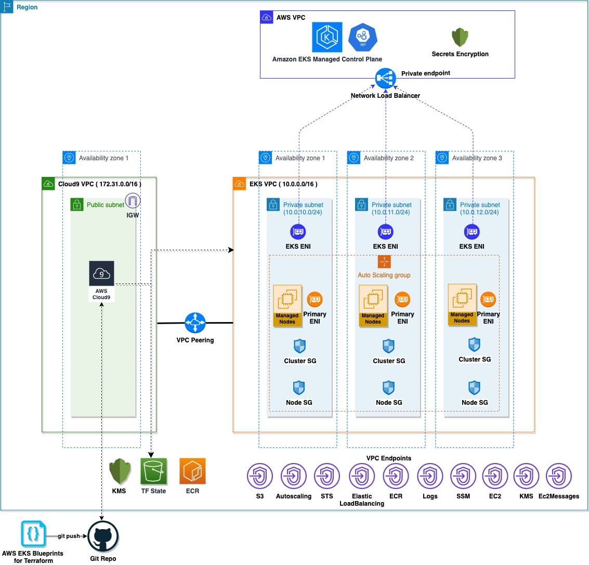

# Fully Private EKS Cluster with VPC and VPC Endpoints deployment

This example deploys a fully private EKS Cluster into a new VPC.

 - Creates a new VPC and 3 Public and Private Subnets
 - VPC Endpoints for various services and S3 VPC Endpoint gateway
 - Creates EKS Cluster Control plane with a private endpoint and with one Managed node group

Please see this [document](https://docs.aws.amazon.com/eks/latest/userguide/private-clusters.html) for more details on configuring fully private EKS Clusters

Here is the high level design of the solution. The solution has been split into 3 different Terraform stacks for simplicity.
1. VPC
2. EKS
3. ADD-ONS

## How to Deploy
### Prerequisites:
1. This examples assumes that you have a default VPC in your AWS account.
2. An EC2 instance running in the default VPC that is running Jekins OR having the pre-requisite tools mentioned below. This EC2 instance can be used as a Jenkins Server OR as a bastion host. For simplicity this EC2 instance is running in the public subnet of this default VPC.
3. The following tools are installed on the EC2 instance.

    3.1. [AWS CLI](https://docs.aws.amazon.com/cli/latest/userguide/install-cliv2.html)

    3.2. [Kubectl](https://Kubernetes.io/docs/tasks/tools/)

    3.3. [Terraform](https://learn.hashicorp.com/tutorials/terraform/install-cli)

### Environment Set up.

1. You can SSH into the EC2 instance to run Terraform commands OR access the Jenkins server running on this EC2 instance to run a jenkins pipeline that can run the below Terraform stack(s). Please note that setting up Jenkins on the EC2 instance is out of scope from this example.

2. Deploy the individual stacks from each of the sub folders. i.e.

    2.1 VPC - Please refer to the [instructions](./vpc/README.md) to deploy a new VPC. 

    2.2 EKS - Please refer to the [instructions](./eks/README.md) to deploy a private EKS cluster.

    2.3 Add-ons - Please refer to the [instructions](./add-ons/README.md) to deploy the add-ons to the private EKS cluster using GitOps.

### Terraform Cloud Instructions

1. If you are using Terraform Cloud to deploy the stack, please ensure you have the following Terraform environment variables set up to run the stack.
    1.1 AWS_ACCESS_KEY_ID
    1.2 AWS_REGION
    1.3 AWS_SECRET_ACCESS_KEY
    1.4 AWS_SESSION_TOKEN

<!--- END_TF_DOCS --->

