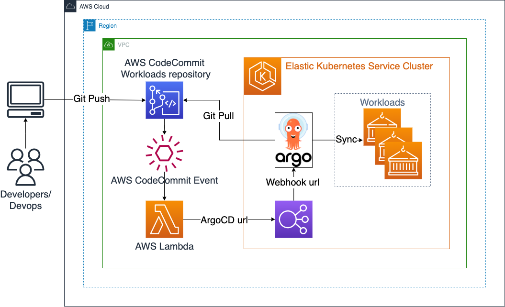
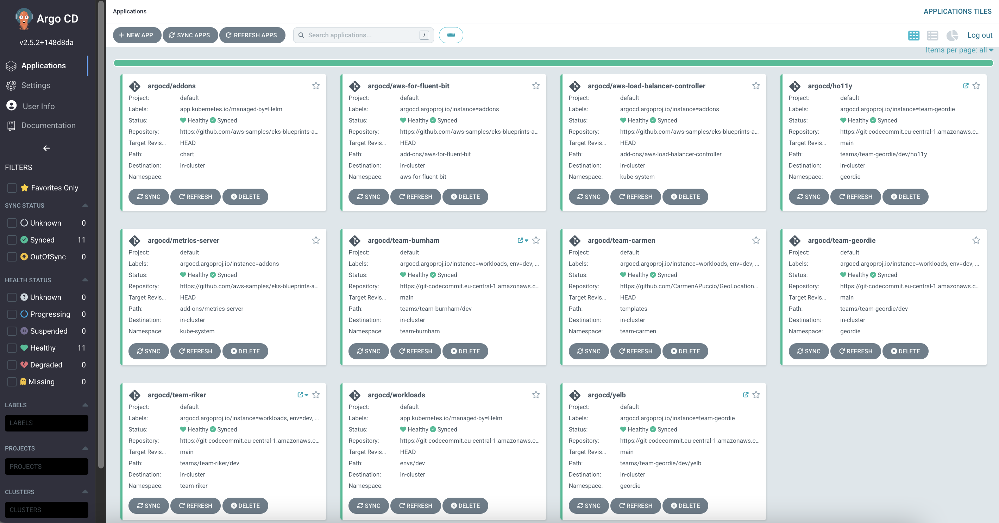

# EKS Cluster with ArgoCD and Workloads in private AWS CodeCommit repository

This example shows how to provision an EKS cluster with:

- ArgoCD
  - Workloads and addons deployed by ArgoCD (main.ft, locals.tf, providers.tf, outputs.tf, data.tf)
  - Private AWS CodeCommit repository and AWS Lambda stack provisioned by included Terraform script (repo-cc.tf) and used for workloads
  - AWS Lambda triggers ArgoCD projects sync using ArgoCD webhook after each push to the AWS CodeCommit repository



To better understand how ArgoCD works with EKS Blueprints, read the EKS Blueprints ArgoCD [Documentation](https://aws-ia.github.io/terraform-aws-eks-blueprints/latest/add-ons/argocd/)

## Reference Documentation

- [Documentation](https://aws-ia.github.io/terraform-aws-eks-blueprints/latest/add-ons/argocd/)
- [EKS Blueprints Add-ons Repo](https://github.com/aws-samples/eks-blueprints-add-ons)
- [EKS Blueprints Workloads Repo](https://github.com/aws-samples/eks-blueprints-workloads)
- [EKS Blueprints for Terraform Workshop](https://catalog.workshops.aws/eks-blueprints-terraform/en-US)

## Prerequisites

Main Terraform files (main.ft, locals.tf, providers.tf, outputs.tf, data.tf) were created using instructions from [EKS Blueprints for Terraform Workshop](https://catalog.workshops.aws/eks-blueprints-terraform/en-US)
Solution specifc sript is repo-cc.tf

Ensure that you have the following tools installed locally:

1. [aws cli](https://docs.aws.amazon.com/cli/latest/userguide/install-cliv2.html)
2. [kubectl](https://Kubernetes.io/docs/tasks/tools/)
3. [terraform](https://learn.hashicorp.com/tutorials/terraform/install-cli)

Change the link of GitHub repository for workloads from [EKS Blueprints for Terraform Workshop](https://catalog.workshops.aws/eks-blueprints-terraform/en-US) to AWS CodeCommit repository provisioned by the stack in repo-cc.tf

```sh
  #---------------------------------------------------------------
  # ARGOCD WORKLOAD APPLICATION
  #---------------------------------------------------------------
  # workload_repo = "https://github.com/ybezsonov/eks-blueprints-workloads.git"
  workload_repo = aws_codecommit_repository.workloads_repo_cc.clone_url_http
```

Update main.tf and enable workloads and addons (if not enabled yet).

```sh
  argocd_applications = {
    addons    = local.addon_application # YOU NEED TO KEEP ADDONS
    workloads = local.workload_application # Comment to remove workloads
  }
```

## Deploy

- Provision this example in the solution directory:

```sh
terraform init
terraform plan
terraform apply
```

Enter `yes` at command prompt to apply

- Configure kubectl using output

```sh
terraform output configure_kubectl
```

- Clone [EKS Blueprints Workloads Repo](https://github.com/aws-samples/eks-blueprints-workloads) from Github to AWS CodeCommit (clone2cc.sh)

```sh
pushd ..
git clone https://github.com/aws-samples/eks-blueprints-workloads.git
git clone https://git-codecommit.$AWS_REGION.amazonaws.com/v1/repos/eks-blueprints-workloads-cc
cd eks-blueprints-workloads-cc
git checkout -b main
cd ..
rsync -av eks-blueprints-workloads/ eks-blueprints-workloads-cc --exclude .git
cd eks-blueprints-workloads-cc
git add . && git commit -m "initial commit" && git push --set-upstream origin main
popd
```

- Wait some time until Elastic Load Balancer will be associated with ArgoCD service (External IP = ELB Url)

```sh
kubectl get svc argo-cd-argocd-server -n argocd
```

```
NAME                    TYPE           CLUSTER-IP       EXTERNAL-IP
argo-cd-argocd-server   LoadBalancer   172.20.228.171   ...elb.amazonaws.com ...
```

- Set ArgoCD url to environment variable

```sh
export TF_VAR_argocd_url=`kubectl get svc argo-cd-argocd-server -n argocd -o json | jq --raw-output '.status.loadBalancer.ingress[0].hostname'`
```

- Update stack to set ArgoCD Url for AWS CodeCommit webhook notifications on Git push

```sh
terraform plan
terraform apply
```

Enter `yes` at command prompt to apply

- Use ArgoCD Url, "admin" user and password below to loging to ArgoCD UI

```sh
echo "ArgoCD URL: https://$TF_VAR_argocd_url"
echo "ArgoCD server user: admin"
echo "ArgoCD admin password: $(kubectl -n argocd get secret argocd-initial-admin-secret -o jsonpath="{.data.password}" | base64 -d)"
```

The following environment should be deployed.


## Destroy

To teardown and [remove](https://catalog.workshops.aws/eks-blueprints-terraform/en-US/050-cleanup) the resources created in this example:

- Delete the Workloads

Update main.tf with the removal of workloads except addons.

```sh
  argocd_applications = {
    addons    = local.addon_application # YOU NEED TO KEEP ADDONS
    #workloads = local.workload_application # Comment to remove workloads
  }
```

```sh
terraform plan
terraform apply
```

Enter `yes` at command prompt to apply

- Remove Kubernetes AddOns modules

```sh
terraform destroy -target=module.kubernetes_addons
```

Enter `yes` at command prompt to apply

- delete EKS Cluster

```sh
terraform destroy -target=module.eks_blueprints
```

Enter `yes` at command prompt to apply

- Delete the remaining modules from the main.tf

```sh
terraform destroy
```

Enter `yes` at command prompt to apply

- Delete EKS Blueprint Log Groups in CloudWatch.


