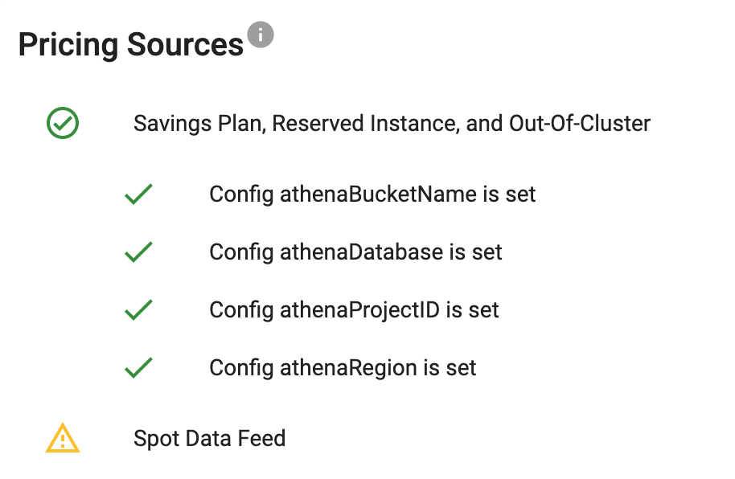

# Kubecost with AWS Cloud Billing Integration

This pattern demostrates how to install and configure Kubecost with AWS CUR report.
The terraform code was created following the official Kubecost documentation for [aws cloud billing integration](https://docs.kubecost.com/install-and-configure/install/cloud-integration/aws-cloud-integrations).

## Prerequisites

You need a valid Kubecost token. To generate one, follow the instructions [here](https://www.kubecost.com/install#show-instructions).

## Apply the Terraform code
```
terraform apply --var="kubecost_token=<your-kubecost-token>"
```

This command will create a S3 bucket with prefix `kubecost-` and a Cost and Usage Report (CUR). Within 24h The CUR will generate a CloudFormation teamplate file called `crawler-cfn.yml` in the S3 bucket. Once that file is generated, navigate to:

```
cd run-me-in-24h/
```
To download and apply the CloudFormation template, run:
```
terraform apply
```

## Kubecost UI
To access the Kubecost UI run:
```
echo http://$(kubectl -n kubecost get svc cost-analyzer-cost-analyzer -o jsonpath='{.status.loadBalancer.ingress[0].hostname}'):9090/
```
and navigate to the output URL.

Navigate to Settings -> Diagnostics -> View Full Diagnostics

Expected result:


> [!NOTE]  
> Spot Data Feed is included in Savings Plan, Reserved Instance, and Out-Of-Cluster.

## Destroy
First destroy the CloudFormation template:
```
cd run-me-in-24h/
terraform destroy
```

```
cd ..
terraform destroy --var="kubecost_token=<your-kubecost-token>"
```
